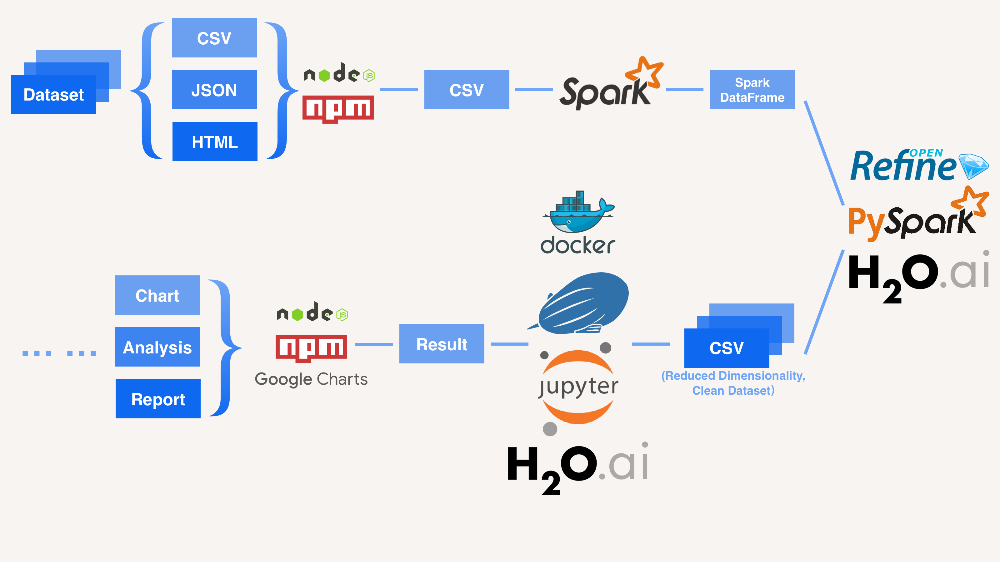

footer: CS9233 - Programming for Big Data Tianyu Wang (tw1707), Yida Zhou (yz4499)
slidenumbers: true

# [fit] Business Performance Estimate 
### [fit] How To Start New Businesses Based On Customers' Reviews

---

# Outline 

- Introduction
- Data Source
- Workflow
- Result
- Conclusion & Future Work

---

# Outline 

- **Introduction**
- Data Source
- Workflow
- Result
- Conclusion & Future Work

---

# Why *location* is so important?

- Directly affect the source of actual audience
- Hard to estimate w/o actual practice and testing
- Time and money consuming
- Risky for new openings
- Also, difficult to figure out key attributes strongly affecting the rating

^ Location is an important factor that directly affect the source of actual audience. But it has always been a difficult problem to estimate a certain consumer-facing business’ performance without actual practice and testing. Which, it is both time consuming and risky for business to seek for new openings locations.

---

# What can *big data* do?

- Suggest a potential opening in designated area
- Estimate performance and rating based on the given location
- Find out the most important factors combined with *machine learning*

^ By utilizing big data approach and machine learning, it is possible to estimate a business’ performance based on the given location, population demographic and nearby similar or supporting facilities. For instance, this product will enable corporate businesses finding new potential opening opportunities in designated area. 

---

# Target Audience?

- Startup or individuals, the ones whom have little or no experience, that willing to take less risks 
- Corporate businesses companies, which want to expand their businesses

---

# Outline 

- Introduction
- **Data Source**
- Workflow
- Result
- Conclusion & Future Work

---

# Data Source

- Yelp / FourSquare
	- 200k businesses
	- 5.2m ratings
- Financial statements from related corporate businesses
- data.gov: statistics of U.S. businesses

---

# Outline 

- Introduction
- Data Source
- **Workflow**
- Result
- Conclusion & Future Work

---

# Workflow

<!--  -->

---

---

# Workflow (Cont.)

- Formatter: convert `.csv`, `.json` and `.html` file into `.csv` 
	- `nodeJS` & `npm`: `json2csv` package
	- Manually collect some useful info from the document
-  Import `.csv` files into `Spark`:
	- Flatten attributes
	- Generate Spark DataFrames

---

# Workflow (Cont.)

- Data Preprocessing:
	- Reduce dimensionality: 
		- Feature selection & extraction
		- Principal Component Analysis (PCA) 
		- Avoid overfitting
	- Clean data

---

# Workflow (Cont.)

-  Data Preprocessing:
	- Export into multiple `.csv` files:
		- Different categories
		- Different cities
		- etc.

---

# Workflow (Cont.)

- Big Data Analysis:
	- Spark SQL module
	- H2O Machine Learning
- Final Result:
	- Chart
	- Analysis

---

# Outline 

- Introduction
- Data Source
- Workflow
- **Result**
- Conclusion & Future Work

---

# Top 10 Categories For Each State

[Chart](https://cee.github.io/Big-Data-Final-Demo/Graph/top-10-categories-Arizona.html)

---

Category | Rating
:-- | :--:
Shaved Ice | 4.408471787
Gelato | 4.378077256
Coffee Roasteries | 4.374378378
Cupcakes | 4.345326146
Street Vendors | 4.328106969
Poke | 4.2968294
Local Services | 4.22552278
Lebanese | 4.224629437
Internet Cafes | 4.19702228
Polish | 4.19209245

---

# Top 10 Cities For Chinese Restaurant

[Chart](https://cee.github.io/Big-Data-Final-Demo/Graph/top-10-cities-for-chinese-restaurant.html)

---

City | Rating
:-- | :--:
Aurora | 3.782264274
Pickering | 3.73193294
Newmarket | 3.729253363
Stuttgart | 3.592544663
Gilbert | 3.560078808
Gastonia | 3.559007997
Edinburgh | 3.558972629
Huntersville | 3.54797137
Fort Mill | 3.47231295
Montreal | 3.465306657

---

# Compare Machine Learning Methods

- [Chart (Group By Method)](https://cee.github.io/Big-Data-Final-Demo/Graph/compare-1.html)
- [Chart (Group By Norm)](https://cee.github.io/Big-Data-Final-Demo/Graph/compare-2.html)

---

Method | MSE | RMSE | r2 | mean-residual-deviance | mae | rmsle
:----------- | :-----------: | :-----------: | :-----------: | :-----------: | :-----------: | :-----------:
Random Forest | 0.099864 | 0.316013 | 0.780328 | 0.099864 | 0.230048 | 0.083253
Deep Learning | 0.428654 | 0.654717 | 0.057082 | 0.428654 | 0.503647 | 0.163133
Gradient Boosting | 0.17661 | 0.42025 | 0.611507 | 0.17661 | 0.282799 | 0.108599
XGBoost | 0.408734 | 0.639323 | 0.100901 | 0.408734 | 0.494821 | 0.159414

---

# Find the Best Location For Opening

- [Map](https://cee.github.io/Big-Data-Final-Demo/Graph/map.html)

---

Latitude | Longitude
:--: | :--:
40.58086784 | -79.96787628
40.45058945 | -79.94779984
40.40169243 | -79.98662125
40.50491615 | -79.84231079
40.52941978 | -79.82238525
40.58066582 | -79.982173
40.43437424 | -80.04482437
40.38809441 | -80.00138367
40.40334869 | -79.80644058
40.59245689 | -80.03174149
40.5477742 | -79.95699326
40.3231459 | -79.73013123
40.44295708 | -79.90212585
40.44473457 | -79.98732758
40.54796066 | -79.80494278
40.33876343 | -79.84385193
40.50610336 | -79.99850159
40.49517776 | -80.00071564
40.43903557 | -79.79106888
40.34159653 | -79.74874847

---

# Attributes

- `Latitude` comes first:
	- Location is really important

---

Attribute | Priority (%)
:----------- | :-----------: 
Latitude | 0.0469
Accepts Credit Cards | 0.0433
Price Range | 0.0349
Good For Kids | 0.0132
Good For Groups | 0.012
Reservations | 0.0108
Take Out | 0.0108
Outdoor Seating | 0.0096
Wi-Fi | 0.0096
Noise Level | 0.0084
Alcohol | 0.0084

---

# Estimate Rating Using Machine Learning Model

- [Map](https://cee.github.io/Big-Data-Final-Demo/Graph/map.html)

---

Latitude | Longitude | Name | Rating | Predicted Latitude | Predicted Longitude | Predicted Rating 
:-- | :-- | :-- | --: | --: | --: | --: 
40.6079763 | -79.9480111 | China One | 5 | 40.58086784 | -79.96787628 | 4.505034676
40.4577813 | -79.9279191 | Leaf and Plate | 4.857142857 | 40.45058945 | -79.94779984 | 3.763362393
40.3850883 | -79.9784211 | Bai Ling Chinese Restaurant | 4.8 | 40.40169243 | -79.98662125 | 2.82598614
40.541389 | -79.785402 | Hing Wong Chinese Restaurant | 4.7 | 40.50491615 | -79.84231079 | 4.193241377
40.5786182 | -79.76802729 | Bamboo Republic | 4.684210526 | 40.52941978 | -79.82238525 | 4.13273994
40.6079763 | -79.9480111 | Great China Buffet & Grill | 4.666666667 | 40.58066582 | -79.982173 | 4.375767517
40.4492001 | -80.1413137 | Golden Palace | 4.6 | 40.43437424 | -80.04482437 | 4.111687226
40.3684469 | -80.0130696 | China Village | 4.6 | 40.38809441 | -80.00138367 | 4.373784394
40.38963749 | -79.76595686 | Asian Cuisine | 4.6 | 40.40334869 | -79.80644058 | 4.077957993
40.6230346 | -80.0532697 | Lucky Chinese Restaurant | 4.571428571 | 40.59245689 | -80.03174149 | 4.155765901
40.5905329 | -79.9483052 | Golden Star | 4.5 | 40.5477742 | -79.95699326 | 3.781827807
40.3245138 | -79.7011549 | Golden Dragon Chinese Restaurant | 4.5 | 40.3231459 | -79.73013123 | 4.144460571
40.4601359 | -79.8662771 | Chopstick House | 4.5 | 40.44295708 | -79.90212585 | 2.739475996
40.4488823 | -79.9873238 | Little Shanghai | 4.428571429 | 40.44473457 | -79.98732758 | 3.222665143
40.5647219 | -79.7646999 | Panda Restaurant | 4.363636364 | 40.54796066 | -79.80494278 | 4.066682773
40.3383835 | -79.8067112 | Asian Garden | 4.333333333 | 40.33876343 | -79.84385193 | 3.47992743
40.55316272 | -80.0155167 | Ting's Kitchen | 4.326923077 | 40.50610336 | -79.99850159 | 3.403362675
40.5207492 | -80.033128 | Yeung's House | 4.306122449 | 40.49517776 | -80.00071564 | 2.916281404
40.4446763 | -79.7136259 | Golden Palace | 4.290322581 | 40.43903557 | -79.79106888 | 4.083773208
40.33327 | -79.744246 | China Garden | 4.277777778 | 40.34159653 | -79.74874847 | 3.631689882

---

# Outline 

- Introduction
- Data Source
- Workflow
- Result
- **Conclusion & Future Work**

---

# Conclusion - Estimated Objectives

- For Individuals:
	- New businesses opening suggestions
	- Given category / area
- For Corporate Businesses:
	- Where to expand
	- How to improve ratings

---

# Conclusion - Estimated Objectives

- For Both:
	- Key attributes affecting on ratings

---

# Future Work

- If given more data:
	- Time lapse: trends
	- More city data
- Rating vs. Profit
	- Long-term eyesight

---

# Q&A

---

# Thank you!